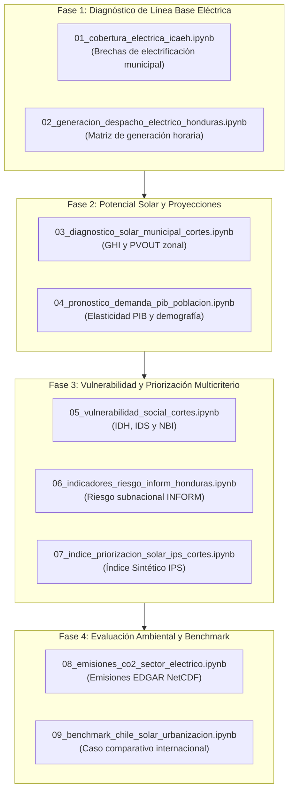

# 📓 Guía de Cuadernos de Análisis (`notebooks/`)

Este directorio contiene los cuadernos Jupyter del proyecto organizados secuencialmente según el flujo metodológico de investigación para el **ODS 7 (Energía Asequible y No Contaminante)** en Honduras.

---

## 🔄 Flujo Metodológico de Ejecución

---

## 📑 Catálogo Detallado de Cuadernos

| # | Cuaderno | Propósito / Alcance | Insumos de Datos (`data/`) | Salidas / Productos |
| :---: | :--- | :--- | :--- | :--- |
| **01** | [`01_cobertura_electrica_icaeh.ipynb`](file:///Users/diegocarcamo/Documents/ods-7/notebooks/01_cobertura_electrica_icaeh.ipynb) | Análisis exploratorio del Índice de Cobertura y Acceso a la Energía Eléctrica (ICAEH 2022–2024). Identifica municipios críticos con cobertura < 50%. | `data/ICAEH/` | `municipios_bajo_50_iae.csv` |
| **02** | [`02_generacion_despacho_electrico_honduras.ipynb`](file:///Users/diegocarcamo/Documents/ods-7/notebooks/02_generacion_despacho_electrico_honduras.ipynb) | Diagnóstico del despacho horario por tecnología generadora (térmica, solar, eólica, hidro) del CND/ENEE y perfil de curva de carga. | `data/sen_despacho_energia/` | Curvas de despacho y estacionalidad |
| **03** | [`03_diagnostico_solar_municipal_cortes.ipynb`](file:///Users/diegocarcamo/Documents/ods-7/notebooks/03_diagnostico_solar_municipal_cortes.ipynb) | Estadísticas zonales de radiación horizontal (GHI) y potencial fotovoltaico (PVOUT) en los 12 municipios de Cortés usando Global Solar Atlas. | `data/boundaries/`, `data/GIS_Data_SolarPower/` | `dataset_indicadores_municipales_enriquecido.csv` |
| **04** | [`04_pronostico_demanda_pib_poblacion.ipynb`](file:///Users/diegocarcamo/Documents/ods-7/notebooks/04_pronostico_demanda_pib_poblacion.ipynb) | Modelado econométrico y proyección de la demanda residencial en función del PIB real (Banco Mundial) y la tasa de crecimiento demográfico. | `data/crn_plan_expansion/`, `data/poblacion_anual_honduras/`, `data/sen_despacho_energia/` | Proyecciones multianuales de demanda |
| **05** | [`05_vulnerabilidad_social_cortes.ipynb`](file:///Users/diegocarcamo/Documents/ods-7/notebooks/05_vulnerabilidad_social_cortes.ipynb) | Construcción del Índice de Vulnerabilidad Social (IVS) integrando IDH, IDS, ingresos per cápita y microdatos EPHPM para focalizar beneficiarios. | `data/perfil_municipal_cortes/`, `data/EPHM/` | `outputs/vulnerabilidad_social_cortes.csv`, gráficos de dispersión y rankings |
| **06** | [`06_indicadores_riesgo_inform_honduras.ipynb`](file:///Users/diegocarcamo/Documents/ods-7/notebooks/06_indicadores_riesgo_inform_honduras.ipynb) | Procesamiento y depuración de la matriz de riesgo subnacional INFORM (amenazas hidrometeorológicas, vulnerabilidad socioeconómica y capacidad). | `data/index/raw/inform_honduras_25_oct_2021.xlsx` | `data/index/processed/indicadores_riesgo_*.csv` |
| **07** | [`07_indice_priorizacion_solar_ips_cortes.ipynb`](file:///Users/diegocarcamo/Documents/ods-7/notebooks/07_indice_priorizacion_solar_ips_cortes.ipynb) | Formulación y cálculo del **Índice de Priorización Solar (IPS)** combinando potencial solar, seguridad climática, infraestructura y capacidad adaptativa. | `data/index/processed/` | `data/index/processed/preseleccion_solar_cortes.csv` |
| **08** | [`08_emisiones_co2_sector_electrico.ipynb`](file:///Users/diegocarcamo/Documents/ods-7/notebooks/08_emisiones_co2_sector_electrico.ipynb) | Ejecución del pipeline de procesamiento zonal de grillas globales NetCDF de EDGAR v8 para cuantificar emisiones de $CO_2$ del sector eléctrico. | `data/Edgar/`, `utils/edgar_process.py` | `data/Edgar/processed/edgar_power_industry_monthly.csv` |
| **09** | [`09_benchmark_chile_solar_urbanizacion.ipynb`](file:///Users/diegocarcamo/Documents/ods-7/notebooks/09_benchmark_chile_solar_urbanizacion.ipynb) | Análisis empírico de la experiencia de penetración solar en Chile como caso de referencia y lecciones aprendidas para la política energética hondureña. | `data/chile_urban/` | Correlaciones de penetración solar vs. urbanización |

---

## 🗄️ Directorio de Borradores y Preliminares (`drafts/`)

Los cuadernos en [`notebooks/drafts/`](file:///Users/diegocarcamo/Documents/ods-7/notebooks/drafts/) corresponden a pruebas iniciales de concepto o scripts exploratorios no definitivos:
- [`gda_preliminar.ipynb`](file:///Users/diegocarcamo/Documents/ods-7/notebooks/drafts/gda_preliminar.ipynb): Primeras pruebas de rasterstats sobre la geodatabase antes de construir el diagnóstico formal consolidado en el notebook `03`.
- [`indice_preliminar.ipynb`](file:///Users/diegocarcamo/Documents/ods-7/notebooks/drafts/indice_preliminar.ipynb): Exploración inicial de lectura de hojas de cálculo del modelo INFORM.
- [`gbif_preliminar.ipynb`](file:///Users/diegocarcamo/Documents/ods-7/notebooks/drafts/gbif_preliminar.ipynb): Plantilla base para análisis de biodiversidad con la API de GBIF.
